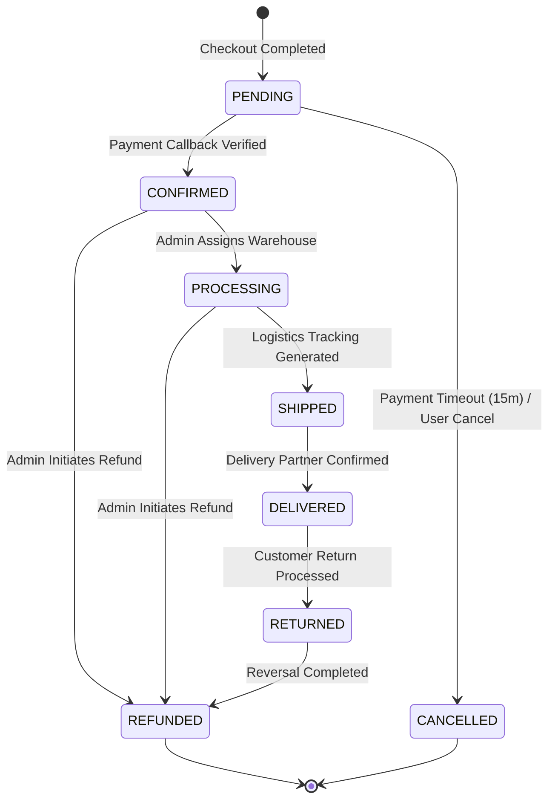

# The Liquid Plus - Enterprise Information Architecture (IA)

This document serves as the absolute blueprint for screen hierarchies, page routing, navigation structures, user flows, and lifecycle systems for **The Liquid Plus**.

---

## 1. Complete Detailed Route Tree & Navigation Hierarchy

### A. Routing Configuration & Page Hierarchy

All page routes conform to the Next.js 15 App Router directory tree.

```
/
├── (auth)/                                  # Route Group for Authentication (No navbar/footer)
│   ├── login/                               # GET  - Login interface page
│   ├── register/                            # GET  - Registration page
│   ├── forgot-password/                     # GET  - Password reset trigger page
│   └── reset-password/                      # GET  - Actual password set page
├── (storefront)/                            # Route Group for Public retail views
│   ├── shop/                                # GET  - Storefront catalog catalog listings page
│   │   ├── categories/                      # GET  - High level categories collection page
│   │   └── category/                        # Dynamic Category Routing
│   │       ├── [parent-slug]/               # GET  - Root category page
│   │       │   └── [sub-slug]/              # GET  - Subcategory page
│   │       └── product/                     # Dynamic Product Details
│   │           └── [slug]/                  # GET  - Product details detail view page
│   ├── cart/                                # GET  - Cart overview page
│   ├── checkout/                            # GET  - Checkout form orchestration
│   ├── orders/                              # Order Confirmation Dynamic views
│   │   └── confirmation/                    # Route group
│   │       └── [id]/                        # GET  - Post-purchase thank you page
│   ├── search/                              # GET  - Search listings page
│   ├── about/                               # GET  - Company background page
│   ├── contact/                             # GET  - Customer inquiry form
│   ├── faq/                                 # GET  - Frequently Asked Questions
│   ├── blog/                                # GET  - Blog collection index page
│   │   └── [slug]/                          # GET  - Blog post view page
│   └── policies/                            # legal Policy pages
│       ├── privacy/                         # GET  - Privacy Policy page
│       ├── shipping/                        # GET  - Shipping Policy page
│       ├── refunds/                         # GET  - Refund and Return Policy page
│       └── terms/                           # GET  - Terms of Service page
├── account/                                 # Route Group for customer profile dashboard
│   ├── dashboard/                           # GET  - Customer central panel (Protected)
│   ├── orders/                              # GET  - Customer order list (Protected)
│   │   └── [id]/                            # GET  - Customer single order invoice (Protected)
│   ├── addresses/                           # GET  - Customer address register (Protected)
│   ├── wishlist/                            # GET  - Customer wishlist panel (Protected)
│   └── profile/                             # GET  - Customer details profile edit (Protected)
└── admin/                                   # Route Group for Dashboard Panel (Protected)
    ├── products/                            # Catalog Management
    │   ├── index/                           # GET  - Admin product tables listing page
    │   ├── new/                             # GET  - Create new product canvas
    │   └── [id]/                            # GET  - Edit product canvas
    ├── categories/                          # GET  - Admin categories directory tree
    ├── brands/                              # GET  - Admin brands manager
    ├── collections/                         # GET  - Admin collections manager
    ├── orders/                              # Fulfillment
    │   ├── index/                           # GET  - Admin orders table list
    │   └── [id]/                            # GET  - Admin order details panel
    ├── inventory/                           # GET  - Stock manager list table
    ├── customers/                           # GET  - Customer registry table listing
    ├── coupons/                             # GET  - Coupon details discount edit panel
    ├── campaigns/                           # GET  - Marketing campaign configurator
    ├── blog/                                # GET  - Admin blog editor dashboard
    ├── pages/                               # GET  - Admin CMS page manager
    ├── media/                               # GET  - Cloudinary media library explorer
    ├── users/                               # GET  - Internal users management table
    ├── roles/                               # GET  - RBAC permission settings panel
    ├── logs/                                # GET  - System log visualizer
    ├── seo/                                 # GET  - Global SEO metadata values
    └── settings/                            # GET  - Store configuration settings
```

---

## 2. Complete Screen Inventory

### A. Storefront Screens

#### 1. Home Page Screen
* **Route**: `/`
* **Purpose**: Showcase brand messaging, active marketing collections, and top navigation.
* **Role**: Guest, Customer
* **Primary Actions**: Click banner CTA, click catalog collection link, click header cart/profile triggers.
* **Required Data**: Hero image URL, active banner subtitle, selected product matrices (first 4 items).
* **Layout Elements**: Premium fullscreen canvas hero banner, 4-column product grid slider, category grid circles.

#### 2. Shop Page Screen
* **Route**: `/shop`
* **Purpose**: Provide central query interfaces for catalog filtering, sorting, and pagination.
* **Role**: Guest, Customer
* **Primary Actions**: Filter by category/price, Sort by price/popularity, Click product card.
* **Required Data**: Paginated products array, list of categories, active variant pricing lists.

#### 3. Product Details Screen
* **Route**: `/shop/category/product/[slug]`
* **Purpose**: Detail variant configurations, reviews, and purchase call-to-actions.
* **Role**: Guest, Customer
* **Primary Actions**: Select variant size/color swatches, Add to Cart, Buy Now.
* **Required Data**: Full product object, variants metadata, review statistics (e.g., `★★★★★ 4.8 (128 Reviews)`).

#### 4. Cart Screen
* **Route**: `/cart`
* **Purpose**: Edit quantities and manage checkout preparations.
* **Role**: Guest, Customer
* **Primary Actions**: Edit item quantities, remove item, Click Checkout.
* **Required Data**: Local Zustand cart items, variant catalog matches, updated pricing rules.

#### 5. Checkout Screen
* **Route**: `/checkout`
* **Purpose**: Capture shipping/billing coordinates and process payments.
* **Role**: Guest, Customer
* **Primary Actions**: Submit shipping form, process Razorpay payment checkout.
* **Required Data**: Cart items, active addresses (if logged in), tax computations.

#### 6. Order Confirmation Screen
* **Route**: `/orders/confirmation/[id]`
* **Purpose**: Display payment confirmation details and track order creation.
* **Role**: Guest, Customer
* **Primary Actions**: Click Order Tracking, print invoice.
* **Required Data**: Order model, transaction reference, created customer registration key (for guest account validation).

---

### B. Admin Screens

#### 1. Dashboard Overview
* **Route**: `/admin`
* **Purpose**: Visual analytics hub showing revenue trends and inventory alerts.
* **Role**: Super Admin, Admin, Order Manager, Product Manager, Marketing
* **Primary Actions**: Select Date Range, Export PDF reports.
* **Required Data**: Sales aggregates, order counts, out-of-stock count.

#### 2. Products List Panel
* **Route**: `/admin/products`
* **Purpose**: Tabular database administration of catalog resources.
* **Role**: Super Admin, Admin, Product Manager, SEO Manager
* **Primary Actions**: Add New Product, bulk change statuses.
* **Required Data**: Paginated products table, category options.

#### 3. Orders Management Table
* **Route**: `/admin/orders`
* **Purpose**: Track fulfillment states and logistics transactions.
* **Role**: Super Admin, Admin, Order Manager, Customer Support
* **Primary Actions**: Update Order Status (Confirmed, Shipped, Delivered), print package label.
* **Required Data**: Paginated orders listing containing customer names and payment details.

#### 4. Media Library Explorer
* **Route**: `/admin/media`
* **Purpose**: Management of assets hosted on Cloudinary CDN.
* **Role**: Super Admin, Admin, Product Manager, Content Writer
* **Primary Actions**: Upload Media files, Delete files, copy CDN URL.
* **Required Data**: Cloudinary folder catalog listings, file size calculations.

---

### C. Customer Dashboard Screens

#### 1. Profile Panel
* **Route**: `/account/profile`
* **Purpose**: Manage password hashes, active email, and notification configs.
* **Role**: Customer
* **Required Data**: User profile object.

#### 2. Address Register
* **Route**: `/account/addresses`
* **Purpose**: Edit shipping and billing address records.
* **Role**: Customer
* **Required Data**: Address list.

#### 3. Customer Orders Invoice List
* **Route**: `/account/orders`
* **Purpose**: View historical transaction receipt items.
* **Role**: Customer
* **Required Data**: Orders array.

---

## 3. Core Enterprise User Journeys

### A. Checkout Redirect Flow (Cart Preservation)
* **Goal**: Minimize checkout friction during mandatory registration checks.
* **Behavior**:
  1. Guest populates cart $\rightarrow$ clicks **Checkout**.
  2. If the user decides to log in/register, local cart state is serialized to browser `localStorage` under `the-liquid-plus-cart`.
  3. User redirects to `/login?callbackUrl=/checkout`.
  4. Upon successful auth, Next.js middleware extracts the query parameter and redirects back to `/checkout`, restoring the cart state.

### B. Guest Checkout Auto-Creation Flow
1. **Visitor** enters shipping details and email during Guest checkout.
2. Order completes successfully and enters database.
3. Upon order confirmation page mounting, a background transaction automatically creates a customer profile using the guest email.
4. An activation email is queued via Resend API containing a secure, single-use token routing to `/reset-password?token=...` allowing the guest to establish a password.
5. All subsequent orders matching this email index under the newly generated user profile.

---

## 4. Extended Lifecycles & State Flows

### A. Wishlist Workflow
* **Guest State**: Guest wishlist selections are stored inside browser cookies (`guest-wishlist`).
* **Auth Syncing**: Upon customer login, cookies are read, matched to database records, added to the customer's permanent `Wishlist` table, and the browser cookie is cleared.
* **Notifications**: If a product variant in a customer's wishlist drops in price by $>10\%$, or drops below 3 units in stock, a background worker triggers an automated alert email.

### B. Coupon Lifecycle
```
[Draft] ──(Admin Publishes)──> [Active] ──(User Applies)──> [Applied] ──(Expires / Depletes)──> [Deactivated]
```
* **Validation Checks**:
  1. **Date Bounds**: Current time must fall within `startDate` and `endDate`.
  2. **Usage Limit**: `currentUsage` must be less than `maxUsage`.
  3. **Cart Threshold**: Total cart value must equal or exceed `minimumCartValue`.
  4. **Customer Limits**: Verify `UserCouponLog` table to guarantee users do not bypass `perUserLimit`.

### C. Return & Refund Workflow
```
[Return Requested] ──(Admin Review)──> [Approved / Rejected]
                              │ (If Approved)
                              ▼
                     [Item Received at WH] ──> [Refund Authorized] ──> [Razorpay Reversal] ──> [Completed]
```
* **Refund Calculations**: Refunds calculate tax deductions and return coupon values proportionally if bulk discounts were applied to the order.

### D. Inventory Lifecycle
```
[Stock Ingested] ──> [Available] ──(Checkout Trigger)──> [Committed] ──(Payment Success)──> [Deducted]
                                                                  └──(Payment Failure)──> [Released back to Available]
```
* **Committed Stock Guard**: Stock is moved from `Available` to `Committed` when checkout is initiated, locking the items for 15 minutes. If checkout times out or payment fails, stock is returned to `Available`.
* **Alert Trigger**: If `Available` stock falls below `lowStockThreshold` (default: 3 units), a notification triggers to warn the Product Manager.

### E. Media Management Flow
* **Upload**: Media uploaded via the Admin Explorer goes directly to Cloudinary using secure presets.
* **Verification**: Database models reference Cloudinary asset URLs.
* **Cleanup**: On product/blog deletion, an asynchronous webhook triggers to delete orphaned assets from Cloudinary.

### F. SEO & Content Publishing Workflow
* **SEO Validation**: Metadata (meta-title, meta-description) must pass validation (e.g. meta-description between 120 and 160 characters) before status shifts from `Draft` to `Published`.
* **Blog Lifecycle**: `Draft` $\rightarrow$ `Review` $\rightarrow$ `Scheduled` (background worker checks release dates) $\rightarrow$ `Published`.

### G. Notification Lifecycle
* **Trigger Event**: Order updates, account recovery, or security logs.
* **Delivery Engine**: Push to Redis queue $\rightarrow$ process worker $\rightarrow$ dispatch via Resend (Email) or WebSockets (Admin dashboard toasts).
* **Logging**: Log status (`Sent`, `Failed`, `Retrying`).

### H. Audit Log Strategy
* All administrative changes to products, inventory levels, billing states, and user permissions trigger an audit log.
* Payload format:
  ```json
  {
    "timestamp": "ISO-8601",
    "userId": "UUID",
    "action": "CREATE | UPDATE | DELETE | STATUS_CHANGE",
    "resource": "Product | Order | User",
    "resourceId": "UUID",
    "changes": {
      "before": { "price": 120.00 },
      "after": { "price": 150.00 }
    },
    "ipAddress": "IPv4/IPv6",
    "userAgent": "String"
  }
  ```

---

## 5. Order State Machine



---
*The Information Architecture has been successfully expanded, finalized, and locked. We are ready to proceed.*
